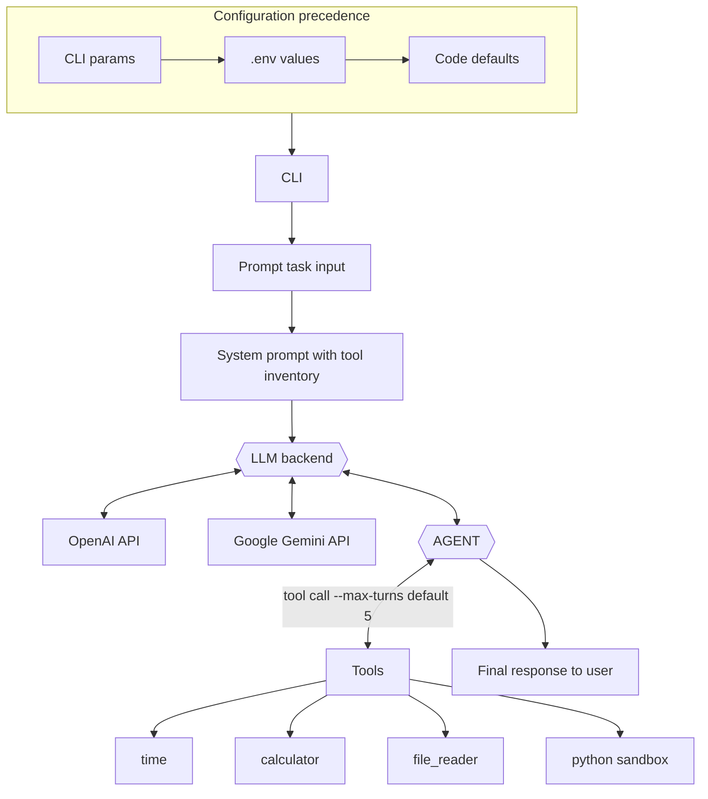

## Simple Agent

[](https://github.com/PythonicNinja/simple-agent/actions/workflows/tests.yml)

A tiny, KISS-friendly command line agent that can talk to either OpenAI's ChatGPT API or Google's Gemini API. The agent supports a pluggable backend, a light tool loop, and environment-driven configuration.

### Architecture



### Examples

#### Disk space:

```bash
| => python main.py "get disk space on current machine using python"
Disk Space:
Total: 926.35 GB
Used: 452.60 GB
Free: 473.76 GB
```

#### CPU usage:

```bash
| => python main.py "give current cpu usage" -v
INFO: Running tool 'python'.
INFO: Responding without tool use.
Current CPU usage: 16.5%
```

#### LLM encoded info: 

```bash
| => python main.py "captial of poland"
Warsaw
```

#### Real time search:

```bash
| => python main.py "search on wiki for top article of today? use python requests"
Top articles on English Wikipedia for 2025-11-06 (most recent complete day):
1. Zohran Mamdani (Views: 1605850)
2. Marshawn Kneeland (Views: 743737)
3. Rama Duwaji (Views: 624732)
4. Mira Nair (Views: 526808)
5. Mahmood Mamdani (Views: 383660)

```


### Make targets (uvx-powered)

The repo ships with a lightweight `Makefile` wired to [`uvx`](https://docs.astral.sh/uv/guides/tools/) for reproducible tooling:

- `make venv` – create a local virtual environment at `env/` (activate with `source env/bin/activate`).
- `make install` – install dependencies (uses `env/bin/python` if `make venv` ran, otherwise falls back to `uvx python`).
- `make run PROMPT="hello"` – run the agent with the provided prompt.
- `make tools` – list the currently wired tools.
- `make lint` – run Ruff via `uvx` (no local install required).

### Quick start

1. Create a virtual environment for Python 3.11+ and install the dependencies:
   ```bash
   make install
   ```
2. Copy `.env.example` to `.env` and fill in the API keys you plan to use.
3. Run the agent:
   ```bash
   make run PROMPT="Summarize the latest message."
   ```

### Configuration

All settings live in `.env` (loaded with `python-dotenv`):

| Variable | Description                                |
| --- |--------------------------------------------|
| `LLM_BACKEND` | `chatgpt` or `gemini`.                     |
| `OPENAI_API_KEY` | Required for the ChatGPT backend.          |
| `OPENAI_MODEL` | Defaults to `gpt-4o-mini`.                 |
| `GEMINI_API_KEY` | Required for the Gemini backend.           |
| `GEMINI_MODEL` | Defaults to `gemini-2.5-flash`.            |
| `AGENT_SYSTEM_PROMPT` | Optional custom system prompt.             |
| `REQUEST_TIMEOUT` | Request timeout in seconds (default `30`). |
| `PYTHON_TOOL_IMPORTS` | Optional comma list of extra python-tool imports (`os,sys,psutil,bs4`). |

To obtain a Gemini API key, head to [Google AI Studio](https://aistudio.google.com/app/apikey), create a key (or use an existing Google Cloud project), and paste it into `GEMINI_API_KEY`. Keys can be revoked or rotated from the same page.

The repository already contains `.env.example` with placeholders for these values.

### CLI options

```
python main.py --help
```

- `prompt` (positional): user message. If missing, you will be prompted in the terminal.
- `--backend`: override the backend without touching `.env`.
- `--max-turns`: maximum number of tool iterations.
- `--no-tools`: disable tool use.
- `--list-tools`: inspect available tools.
- `-v/--verbose`: increase logging (use `-vv` for debug-level traces about tool usage).
- `-q/--quiet`: suppress logs (errors only).

### Tools

Tools live under `simple_agent/tools` and implement a tiny interface (`name`, `description`, `run`). Two simple defaults ship with the CLI:

- `time`: returns the current UTC timestamp.
- `calculator`: evaluates small arithmetic expressions safely.
- `file_reader`: dumps a snippet of a local text file (`path[:start-end]`).
- `python`: runs a short Python snippet in a separate interpreter (default imports include `math`, `json`, `os`, `sys`, `psutil`, `bs4`; extend via `PYTHON_TOOL_IMPORTS`).

The python tool executes with a module allowlist. By default it includes: `collections`, `datetime`, `functools`, `itertools`, `json`, `math`, `os`, `pathlib`, `psutil`, `random`, `statistics`, `sys`, `time`, `bs4`. Set `PYTHON_TOOL_IMPORTS` (comma separated) to append additional modules if needed (e.g., `requests`).

Adding new tools only requires dropping a module next to the others and including it in `load_default_tools()`.

### Extending the agent

- To add more model providers, create a new backend in `simple_agent/backends` that implements `LLMBackend`.
- Swap in custom tools by editing `load_default_tools()` or wiring your own list in `main.py`.
- For more complex automations, adjust the system prompt or max turn count to shape the agent's autonomy.
